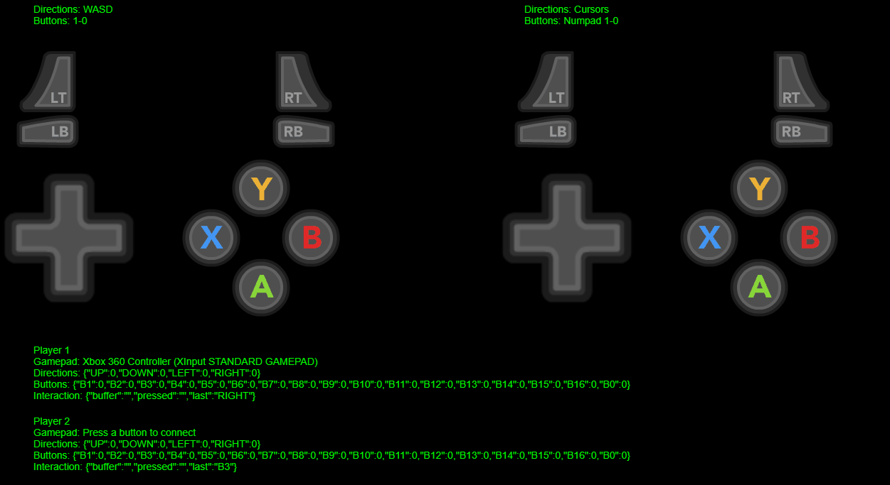

# Merged input plugin for Phaser 3
A Phaser 3 plugin to map input from keyboard, gamepad & mouse to player actions.

The merged input plugin listens to input from keyboard, connected gamepads and the mouse pointer, updating ‘player’ objects that you may interrogate instead of writing separate input handlers in your game.
Each player object contains direction and button actions. These are updated by the corresponding gamepad input, as well as any keys that you assign to the action.

## Benefits 
. Single place to handle all your input.  
. Keyboard, Gamepad & Mouse input is amalgamated.  
. Handle input for multiple player objects to easily create multiplayer games.  
. Assign and reassign keys to actions for each player, allowing for ‘redefine keys’ function.  
. Assign multiple keys to a single action.  
. Interrogate current state of all buttons.  
. Global events emitted on button down/up.  
. Check for gamepad button presses (i.e. ‘justDown()’ functionality for gamepads)  
. Check the last device type used for interaction.  
· (v1.4.0) Button mapping to consistent names such as 'RC_X' for the right cluster of buttons  
· (v1.4.0) Normalising of gamepad devices, including generating dpad events for gamepads that map them as axis internally  

## Installation

```
npm install phaser3-merged-input
```

Then you can either add the plugin to Phaser 3's global configuration:

```javascript
const config = {
    plugins: {
        scene: [
            {
                key: "mergedInput",
                plugin: MergedInput,
                mapping: "mergedInput",
            },
        ],
    }
};
```

Or using a scene's local configuration:

```javascript
class InputController extends Phaser.Scene {
    preload() {
        this.load.scenePlugin('mergedInput', MergedInput);
    }
```
  

### TypeScript

If you're using TypeScript, you will also need to add a class member to the scene so TypeScript knows how to type it.

**Example**:

```typescript
class InputController extends Phaser.Scene {
    private mergedInput?: MergedInput;
```

If you're using the Phaser global config for the plugin, the member name **must** have the same name as the value the `mapping` property specified in the Phaser configuration above, or the plugin won't work.

If you're using the scene local plugin, the member name **must** match the key specified in `scenePlugin(key, ...)`.    

---

## Setup
Set up a player object for each player in your game with `addPlayer()`.
Then assign keys to each action with the `defineKey()` function, e.g.
```javascript
var player1 = mergedInput.addPlayer(0);
mergedInput.defineKey(0, 'UP', 'W')
    .defineKey(0, 'DOWN', 'S')
    .defineKey(0, 'LEFT', 'A')
    .defineKey(0, 'RIGHT', 'D')
    .defineKey(0, 'B0', 'U')
    .defineKey(0, 'B1', 'I')
    .defineKey(0, 'B2', 'O')
    .defineKey(0, 'B3', 'P')

var player2 = mergedInput.addPlayer(1);
mergedInput.defineKey(1, 'UP', 'UP')
    .defineKey(1, 'DOWN', 'DOWN')
    .defineKey(1, 'LEFT', 'LEFT')
    .defineKey(1, 'RIGHT', 'RIGHT')
    .defineKey(1, 'B0', 'NUMPAD_0')
    .defineKey(1, 'B1', 'NUMPAD_1')
    .defineKey(1, 'B2', 'NUMPAD_2')
    .defineKey(1, 'B3', 'NUMPAD_3')
```

### NEW in v1.4.0
You may now choose to use 'mapped button names' to define keys, instead of button numbers.
The plugin will attempt to map each button to the corresponding number, depending on the type of joypad entered.
So, instead of using B0, which is the 'A' button on an Xbox controller, but the 'B' button on an 8-bit Do controller, and the 'X' button on a GeeekPi controller, you can now use 'RC_S' for 'Right cluster: South' - for a more consistent approach.
```javascript
    var player1 = mergedInput.addPlayer(0);
    mergedInput.defineKey(0, 'UP', 'W')
        .defineKey(0, 'DOWN', 'S')
        .defineKey(0, 'LEFT', 'A')
        .defineKey(0, 'RIGHT', 'D')
        .defineKey(0, 'RC_S', 'U')
        .defineKey(0, 'RC_E', 'I')
        .defineKey(0, 'RC_W', 'O')
        .defineKey(0, 'RC_N', 'P')
```

Then, interrogate your player objects to check for the state of the _action_, rather than the key, e.g.
```javascript
    if(player1.direction.DOWN) {
        // Move your player down. This will remain true for as long as the down button is depressed.
    }

    if(player2.buttons.B0 > 0) {
        // Player two is pressing the first button. This will remain true for as long as B0 is depressed.
    }

    if(player1.buttons_mapped.RC_W > 0) {
        // Player one is pressing left button in the right cluster. This will remain true for as long as the button is depressed.
    }

    if(player1.buttons_mapped.START > 0) {
        // Player one is pressing what the plugin considers to be the 'start' button - depending on the controller config.
    }

    if(player1.interaction.device == 'gamepad') {
        // Player one is using a gamepad, you may wish to update your prompts accordingly.
    }

    if (['B8', 'B9', 'B0'].filter(x => player1.interaction.pressed.includes(x)).length) {
        // Player one has just pressed one of the following buttons - B8, B9 or B0.
        // The 'pressed' interaction flag differs from interrogating the buttons directly. It will contain the button(s) pressed for a single update tick, as it happens.
        // Here we're comparing an array of button names to the array of buttons pressed in the step.
    }

    // NEW in v1.6.0
    if (player1.interaction.isPressed(['RC_S', 'LC_E'])) {
        // Player one has just pressed one of the following buttons - Right cluster: South or Left cluster (DPad): East.
        // Instead of comparing arrays directly as above, we're using the included helper function here, which will return any matching buttons that were pressed in this update step.
    }
```

## Demo / Dev
A demo scene is included in the repository.  
The demo has been updated to incorporate the mapped buttons and interactions included in v1.4.0 and the helper functions added in v1.6.0  

  

Install with `npm install`, then use `npm run dev` to spin up a development server and run the demo scene.


## Build plugin
Build the plugin including minified version. Targets the dist folder.
`npm run build`

## Changelog
v1.6.1 - 2023-06-01  
Updated pointer events to only be set when adding the first player.
Pointer events now check for player object.
Updated typings
With many thanks to @Dan-Mizu for help with this release.

v1.6.0 - 2022-12-05  
Improved handling of the 'pressed' and 'released' events. Previously it was possible to miss a press event if two happened within the same update step.  
**IMPORTANT:** The `pressed` & `released` properties under the player's `interaction` object has changed from a string to an array, to allow for multiple values in an update step.  
Any code that checks these properties should be updated to expect an array of one or more values.
New helper functions `isPressed()` and `isReleased()` have been added to the `interaction` and `interaction_mapped` properties of the player object.
Use these to check if one or more buttons were pressed/released in the current update step. See the demo for more details.

v1.5.0 - 2022-08-22  
When the game loses focus, the plugin will now reset each of the defined keys to avoid them getting stuck when returning to the game.

v1.4.0 - 2022-07-03    
Added normalisation of gamepad devices, using mapping files located in the new `configs` folder.  
Added friendly mapped button names, and a new batch of properties under `interaction_mapped` and `buttons_mapped`.  
Added fake DPad functionality to better handle joypads that map their DPads to the left axis, instead of the standard buttons 12-15.  
Added a debug scene to the demo.  

v1.3.1 - 2022-03-11  
Fixed missing code caused by bad merge!  
Added keywords  
Clean up readme.md  

v1.3.0 - 2022-03-10  
Migrated keyboard interaction flags from the `justDown` and `justUp` key functions, to instead use the keyboard's `keyDown` and `keyUp` events.  
This way we maintain consistancy between keyboard and gamepad interactions, as events trigger before the scene's update call.  
Added a new `released` key to the interaction object to indicate when a button has been released.  
Added a new `lastPressed` and `lastReleased` key, to replace the existing `pressed` key - the old `pressed` key remains for backwards compatability.  
Added TypeScript support.  
With many thanks to @zewa666 and @bbugh for help with this release.  

v1.2.8 - 2021-07-23  
Added gamepad directions to interaction buffer/presses to match keyboard interactions.

v1.2.7 - 2021-07-06  
Changed the order of buffer/pressed checking in update loop.

v1.2.6 - 2021-05-04  
Guess who forgot to build again??

v1.2.5 - 2021-05-04  
Updated buttondown and buttonup event listeners from per pad, to per input system.
It seems the per pad listeners weren't firing for pad 2 and this method works around the problem.
Also added an addPlayer call if the corresponding player is missing.
Updated phaser dependancy

v1.2.4 - 2020-05-08  
And again, remembering to include the built files would be a bonus.

v1.2.3 - 2020-05-08  
Added extra handling for 'null' gamepads.

v1.2.2 - 2020-05-03   
Added secondary direction key detection, so that secondary directions may be instigated through a keypress as well as the right stick of a gamepad.
Added timestamps to interactions making it possible to tell which was last used, e.g. keyboard vs mouse.

v1.2.0 - 2020-04-27  
You are now able to pass a player's X/Y position to a player object, whereupon the position of the mouse in relation to that player will be used to determine mouse bearings and degrees

v1.2.1 - 2020-04-27  
Actually added the build files.

v1.1.0 - 2020-04-19  
Plugin now handles secondary directional movement from the second stick on a gamepad.
Bearings and degrees have been added to direction objects.


## Credits
Written by [Gary Stanton](https://garystanton.co.uk)  
Built from the [Plugin Starter Kit](https://github.com/nkholski/phaser-plugin-starter) by Niklas Berg  
Demo sprites by [Nicolae Berbece](https://opengameart.org/content/free-keyboard-and-controllers-prompts-pack)  

---

## Functions

<dl>
<dt><a href="#addPlayer">addPlayer(index)</a></dt>
<dd><p>Add a new player object to the players array. <br/>If an index is provided and a player object at that index already exists, this will be returned instead of another object created</p>
</dd>
<dt><a href="#getPlayer">getPlayer(thisPlayer)</a></dt>
<dd><p>Get player object</p>
</dd>
<dt><a href="#setupControls">setupControls()</a></dt>
<dd><p>Returns a struct to hold input control information
Set up a struct for each player in the game
Direction and Buttons contain the input from the devices
The keys struct contains arrays of keyboard characters or mouse buttons that will trigger the action</p>
</dd>
<dt><a href="#defineKey">defineKey(player, action, value, append)</a></dt>
<dd><p>Define a key for a player/action combination</p>
</dd>
<dt><a href="#isPressed">{player}.interaction.isPressed(button)</a></dt>
<dd><p>Pass one or more button names to check whether one or more buttons were pressed during an update tick.</p>
</dd>
<dt><a href="#isReleased">{player}.interaction.isPressed(button)</a></dt>
<dd><p>Pass one or more button names to check whether one or more buttons were released during an update tick.</p>
</dd>
</dl>

<a name="addPlayer"></a>

## addPlayer()
Add a new player object to the players array  

| Param | Type |
| --- | --- |
| index | <code>number</code> | 


<a name="getPlayer"></a>

## getPlayer(index)
Get player object

| Param | Type |
| --- | --- |
| thisPlayer | <code>number</code> | 


<a name="defineKey"></a>

## defineKey(player, action, value, append)
Define a key for a player/action combination
| Param | Type | |
| --- | --- | --- |
| player | <code>number</code> | The player on which we're defining a key |
| action | <code>string</code> | The action to define |
| value | <code>string</code> | The key to use |
| append | <code>boolean</code> | When true, this key definition will be appended to the existing key(s) for this action |

<a name="isPressed"></a>

## {player}.interaction.isPressed(button)
Check if button(s) were pressed during an update tick

| Param | Type |
| --- | --- |
| button | <code>string/array</code> | 


<a name="isReleased"></a>

## {player}.interaction.isReleased(button)
Check if button(s) were released during an update tick

| Param | Type |
| --- | --- |
| button | <code>string/array</code> | 
